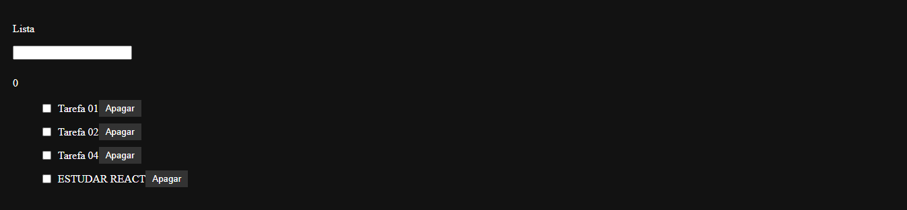
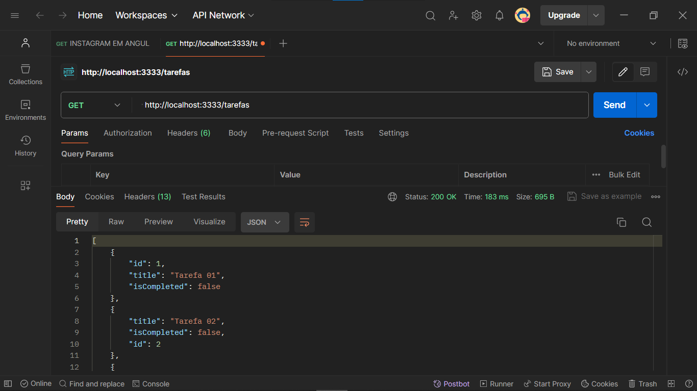
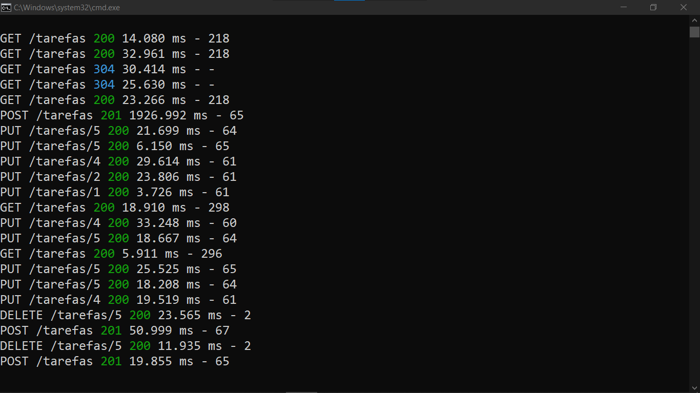

# LISTA DE TAREFAS COM REACT
👨‍🏫PROJETO CRIADO PARA O CURSO DE REACT.

 <br> 
 <br> 
 <br> 
 <br> 

## DESCRIÇÃO:
- Este aplicativo React é uma lista de tarefas simples que permite aos usuários adicionar novas tarefas, marcar tarefas como concluídas e excluí-las da lista.

- Os usuários podem usar este aplicativo para criar listas de tarefas pessoais, acompanhar seu progresso e garantir que todas as tarefas sejam concluídas de forma eficiente. Ele fornece uma maneira simples e intuitiva de gerenciar tarefas diárias de maneira organizada.

## FUNCIONALIDADES:
1. **Adicionar Tarefa:**
   - Os usuários podem adicionar uma nova tarefa digitando seu título na caixa de entrada e pressionando a tecla "Enter". A nova tarefa será adicionada à lista.

2. **Marcar Tarefa como Concluída:**
   - Cada tarefa na lista é exibida com uma caixa de seleção ao lado do seu título. Os usuários podem marcar uma tarefa como concluída clicando na caixa de seleção. A tarefa será marcada como concluída e seu estilo será atualizado para refletir o status.

3. **Excluir Tarefa:**
   - Ao lado de cada tarefa, há um botão "Apagar". Os usuários podem clicar neste botão para excluir a tarefa da lista.

4. **Serviço de Tarefas (TarefasService):**
  - O aplicativo se integra a um serviço de tarefas que fornece operações quase CRUD (Criar, Ler, Excluir - Não permite Editar) para gerenciar as tarefas. Isso permite que o aplicativo interaja com um backend ou uma API para armazenar e recuperar dados de tarefas.

## EXECUTANDO O PROJETO:
1. **Instalar as dependências do projeto**:
   - Execute o comando no diretório `CODIGO/`:
     ```cmd
     npm install
     ```
   Este comando instala todas as dependências listadas no arquivo `package.json` do seu projeto. Certifique-se de estar no diretório do seu projeto ao executar este comando.

2. **Iniciando o Servidor Localmente:**
   Antes de fazer solicitações para a URL da API, é necessário iniciar o servidor localmente. Se estiver usando o framework Adonis.js, você pode iniciar o servidor executando o comando:
   ```cmd
   yarn mock
   ```

3. **Executando o Aplicativo:**
   - Para subir o servidor, no diretório do seu [projeto](./CODIGO), abra outro Terminal/CMD e digite o seguinte comando:
   ```bash
   npm start
   ```
   - Acesse o APP no navegador visitando `http://localhost:3000/pagina-inicial`.

4. **Consultando API:**
   - Para testar a API, você pode utilizar uma ferramenta de cliente HTTP, como o **Postman**, **Insomnia**, **Paw** ou **SoapUI**. Você pode acessar a API usando o seguinte link:
   ```
   http://localhost:3333/tarefas
   ```

5. **Usando o APP:**
   - **Visualização da Lista de Tarefas:**
      - Ao acessar o aplicativo, você verá uma lista de tarefas existentes, se houver alguma.
      - Cada tarefa terá um título e uma caixa de seleção que indica se ela está concluída ou não.
      - Você também verá um contador que mostra o número de tarefas concluídas.

   - **Adicionar uma Nova Tarefa:**
      - Na parte superior da página, há um campo de entrada onde você pode digitar o título de uma nova tarefa.
      - Pressione a tecla "Enter" para adicionar a tarefa à lista.
      - A nova tarefa será exibida na lista abaixo.

   - **Marcar uma Tarefa como Concluída:**
      - Ao lado de cada tarefa, há uma caixa de seleção.
      - Clique na caixa de seleção para marcar a tarefa como concluída.
      - A tarefa será automaticamente atualizada na lista, mostrando que está concluída.

   - **Excluir uma Tarefa:**
      - Ao lado de cada tarefa, há um botão "Apagar".
      - Clique no botão "Apagar" para remover a tarefa da lista.

   - **Interagir com a Aplicação:**
      - Sinta-se à vontade para adicionar, marcar como concluída ou excluir tarefas conforme necessário.
      - A lista de tarefas será atualizada em tempo real para refletir as alterações feitas.
      - Se ocorrer algum erro durante as operações, você será notificado com uma mensagem de alerta.

## NÃO SABE?
- Entendemos que para manipular arquivos em `HTML`, `CSS` e outras linguagens relacionadas, é necessário possuir conhecimento nessas áreas. Para auxiliar nesse aprendizado, oferecemos cursos gratuitos disponíveis:
* [CURSO DE HTML E CSS](https://github.com/VILHALVA/CURSO-DE-HTML-E-CSS)
* [CURSO DE NODEJS](https://github.com/VILHALVA/CURSO-DE-NODEJS)
* [CURSO DE REACT](https://github.com/VILHALVA/CURSO-DE-REACT)
* [CURSO DE API REST](https://github.com/VILHALVA/CURSO-DE-API-REST)
* [CURSO DE JSON SERVER](https://github.com/VILHALVA/CURSO-DE-JSON-SERVER)
* [CONFIRA MAIS CURSOS](https://github.com/VILHALVA?tab=repositories&q=+topic:CURSO)

## CREDITOS:
- [PROJETO FEITO PELO VILHALVA](https://github.com/VILHALVA)
- [PROJETO CRIADO PARA O CURSO DE REACT](https://github.com/VILHALVA/CURSO-DE-REACT)


